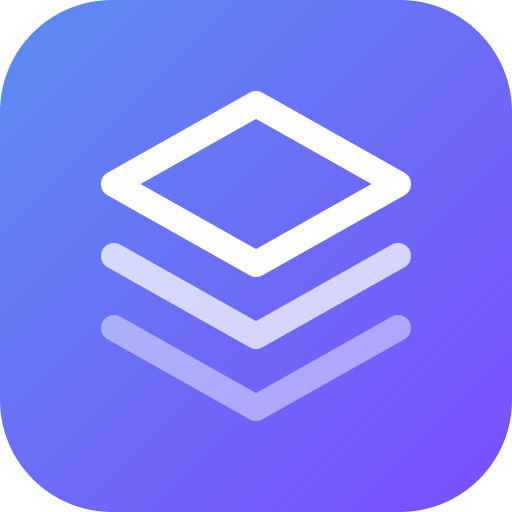

<p align="center">
  
</p>

<h1 align="center">agentui-tools</h1>

<p align="center">
  Teach your coding agent that it can build and host <strong>real</strong> apps —
  database, auth, file storage, serverless endpoints, cron jobs, a custom MCP server
  and API integrations — through the
  <a href="https://www.npmjs.com/package/@agentuiai/cli"><code>@agentuiai/cli</code></a>.
</p>

---

Ask an agent for "a tool to track tire inspections" and it scaffolds a local project
nobody can open on their phone. With this plugin it returns a URL — with a Postgres
database, logins, uploads and an `/api`. Ask it for "an MCP server" and it builds and
hosts a standalone one instead of hand-rolling transport and auth.

Works in **Cursor**, **Codex**, **Claude Code**, **Gemini CLI**, and any client that
reads the [Agent Plugins](https://agent-plugins.org) format — one skills folder, four
manifests.

## Install

### Cursor

```bash
git clone https://github.com/agentui-ai/agentui-tools.git ~/.cursor/plugins/local/agentui-tools
```

Reload Cursor, then confirm the skills appear under **Customize → Plugins / Skills**.
Local imports must be allowed by your admin under
*Dashboard → Settings → Security & Identity → Marketplace and Plugins*.

### Codex

```bash
codex plugin marketplace add agentui-ai/agentui-tools
codex plugin add agentui-tools@agentui
```

### Claude Code

```bash
claude --plugin-dir /path/to/agentui-tools          # try it for one session
```

or install it properly:

```
/plugin marketplace add agentui-ai/agentui-tools
/plugin install agentui-tools@agentui-tools
```

### Gemini CLI (and ~75 other agents)

Gemini CLI has no plugin marketplace, so install the skills directly:

```bash
npx skills add agentui-ai/agentui-tools --agent gemini-cli --global
```

They land in `~/.agents/skills/`, the shared Agent Skills location. Drop `--global` to
install into the current project instead, and swap the agent id (`opencode`, `aider`, …)
for any other supported agent.

### Any Agent Plugins client

Point it at the repository root — `plugin.json` and `skills/` are where the spec
expects them.

### Prerequisite

```bash
npm install -g @agentuiai/cli    # Node 22+
agentui auth login
```

## What is in it

| Skill | Opens when |
| --- | --- |
| `agentui-platform` | The router — what AgentUI can host, and which skill is next |
| `agentui-ship-app` | Create → edit → push → build → live URL; settings, environments, secrets |
| `agentui-app-data` | Entity schemas, hosted Postgres tables, reading records, row-level security |
| `agentui-app-files` | Upload, share, publish and delete workspace files |
| `agentui-mcp-tools` | `defineTool` in `mcp/*.js` + `mcp/guides/*.md` — a standalone MCP server, or one on top of an app |
| `agentui-integrations` | Use installed integrations, or author a new one in one JSON spec |
| `agentui-automations` | Cron / webhook / email jobs running on Deno beside the app |
| `agentui-troubleshoot` | Validation, stale builds, logs, and reporting broken CLI behaviour |

All eight are model-invoked: the agent reaches for them on its own when a request needs
hosting, a database, storage, an MCP tool or an integration.

Claude Code additionally gets a `SessionStart` hook that detects `.agent.json` in the
working directory and warns that local edits are server-side records, and that push ≠
live. It prints nothing anywhere else, and other clients ignore it.

## Layout

```text
agentui-tools/
├── plugin.json              # Agent Plugins manifest
├── .cursor-plugin/
│   └── plugin.json          # Cursor manifest
├── .codex-plugin/
│   └── plugin.json          # Codex manifest
├── .agents/plugins/
│   └── marketplace.json     # so `codex plugin marketplace add` finds it
├── .claude-plugin/
│   ├── plugin.json          # Claude Code manifest
│   └── marketplace.json     # so it installs as a one-plugin marketplace
├── assets/logo.svg
├── skills/<name>/SKILL.md   # shared by every client
└── hooks/                   # Claude Code only
```

There is **no `mcp.json`**, on purpose. An AgentUI app's MCP endpoint is credentialed
per app user and per environment, so there is no server URL or token that could be
shipped in a manifest — the user mints theirs from the running app. The
`agentui-mcp-tools` skill covers that flow.

## Design note

The skills carry the **CLI workflow** — the order of commands, the guardrails, the
failure modes — and deliberately avoid copying the platform's app-code conventions.
Those move, and a stale copy is worse than no copy. Every skill points at the live
sources instead: `agentui guide <topic>`, `agentui skills info <name>`, and the project's
own `AGENTS.md` (with `agentui project instructions --check` to prove it is current).
`agentui-mcp-tools` is the one place that shows an authoring contract, because the shape
is hard to guess from nothing — and it still sends you to `agentui skills info mcp-tools`
before you write a line.

Everything asserted about the CLI was verified against `apps/cli/src` in the AgentUI
repo, not against its README — the two disagree in several places (`deploy` does create
components; `validate` exits 0 on findings; production `build` needs `--yes`).

## Develop

```bash
claude plugin validate .     # validates the Claude Code manifest
```

Edit a `SKILL.md`, then `/reload-plugins` in Claude Code or reload the window in Cursor.

## License

MIT — see [LICENSE](LICENSE).
